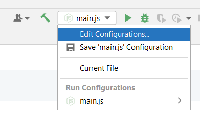
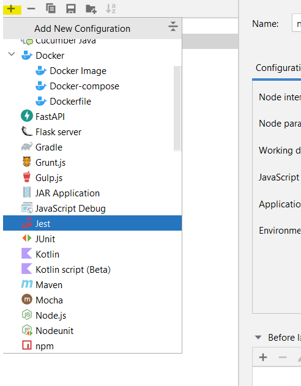
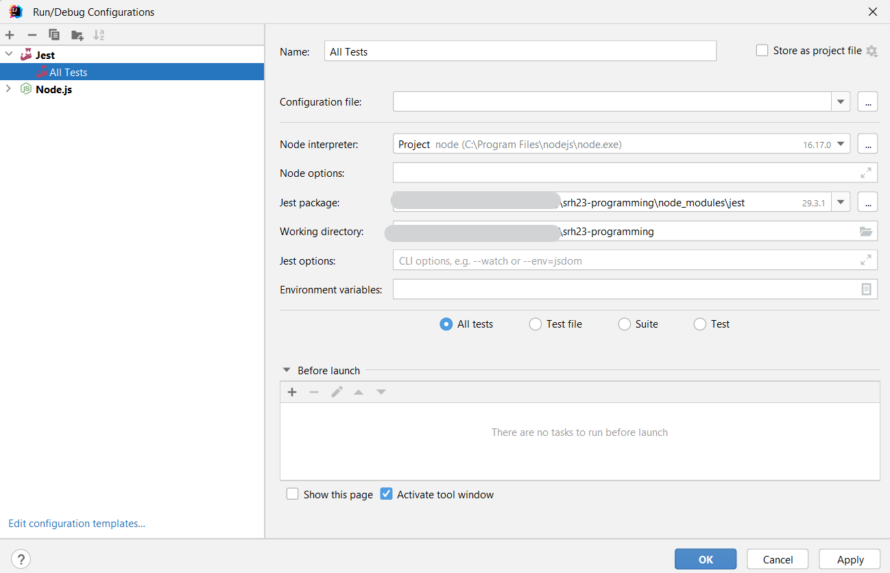
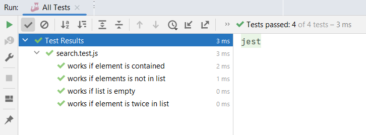

# Summer 2024, Semester 2 | Boilerplate 

## Prerequisites

Node version >= 18

## Getting started

Install community dependencies of this project:

    npm install

Start API server:

    npm run start

Or execute in the ide with creating a run configuration. Right-click the file `main.js` and select *Run* from
context menu.

## Tests

Run tests with:

    npm test

Or again by creating a run configuration for IntelliJ to use the debugger effectively.

1. Select *Edit Configurations...* from the run menu on the top right of the screen.

2. Press the "+"-button in the top left corner of the dialog and select "Jest" from the options.

3. If you ran `npm install`before, the run config should look like the one below. Press "Ok" and hit the play button right to the
   field for selecting run configurations.

The tool window below should show something similar to what is depicted here:

Using the execution by the IDE (creation of a run configuration) allows you to set breakpoints in your code or the test
code and execute the tests in debug mode. This is a strong advantage compared to terminal execution.

## Setting up Jest as test framework

NOTE: Only do this for new projects. Jest is already configured properly for this project here.

To use jest as test runner in your project you need to install it first

    npm install jest --save-dev

Jest is not a part of your application, more a tool of your development environment. This means, your application runs
without it and thus Jest is not real dependency of your application. In the npm world those dependencies are called
"development dependencies". To make sure they end up in the corresponding block of you `package.json` (devDependencies),
don't forget to add the `--save-dev` flag to the "install"-statement.

You can now execute your tests with running:

    jest

Or you add a run script your `package.json`, which for example looks like that:

    "scripts": {
        "test": "jest --verbose"
    },

Then you can start the tests with running `npm test`.

__Note: You can only have one `scripts` block in your `package.json` __

If you want jest to run with ES6 modules (`import` and `export`) you additionally need to install "Babel", a so called
transpiler, which brings pre-ES6 code (like Jest) to ES6 level by transpiling ES6 code to older syntax versions. When
using Jest with ES6 modules, mocking modules becomes more difficult though.

Install babel with:

    npm install babel-jest --save-dev
    npm install @babel/preset-env --save-dev

Add a minimal `.babelrc` configuration file to the project root with the following content:

    {
    "presets": ["@babel/preset-env"]
    }

Add a block to your `package.json` file that reads:

    "jest": {
        "transform": {
        "^.+\\.jsx?$": "babel-jest"
        }
    },

In this block you configure Jest to make use of the Babel transpiler for all files ending with `.js` or `.jsx`.

Now you can run tests on code with ES6 module syntax.

